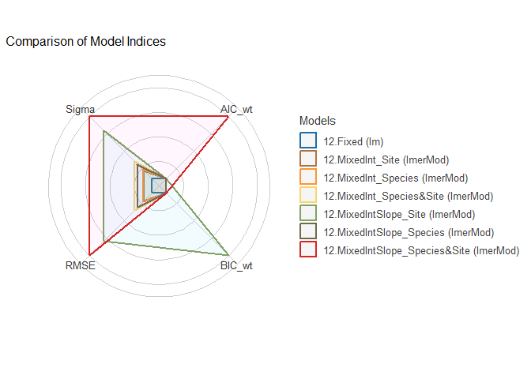
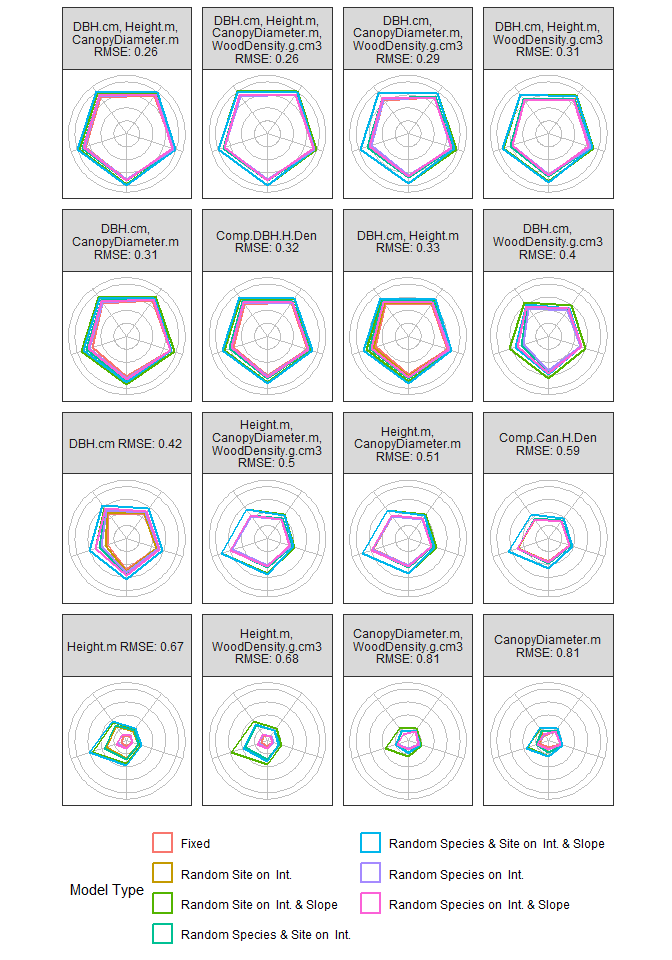
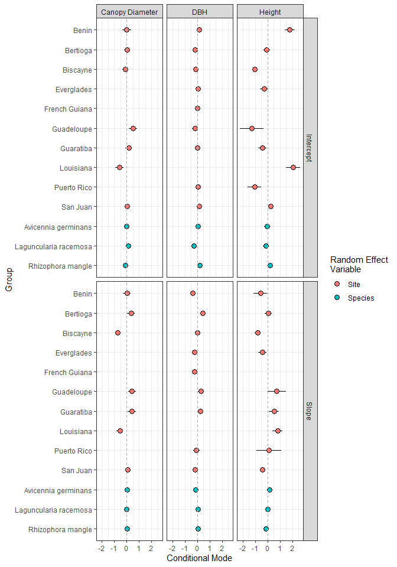

Local vs global allometric equations: Evaluating multiple variables in
mixed effects models for biomass estimation using a global mangrove data
compilation
================
Benjamin Branoff & Charles Price.
April 8, 2026

# Description

This is the repository for the journal article: Price et al. (2026)
Local vs global allometric equations: Evaluating multiple variables in
mixed effects models for biomass estimation using a global mangrove data
compilation. For the more general ‘treellometry’ package, visit the
[‘master’ branch](https://github.com/BBranoff/treellometry/master).

# Abstract

Accurate estimation of mangrove biomass is key component of the blue
carbon economy and allometric equations are a cornerstone of
methodological approaches from plot to landscape scales. A perennial
question facing investigators is whether global allometric equations can
be applied to their biome of interest, or whether local trees need to be
harvested to provide accurate estimates. Further, which combinations of
tree dimensions provide the most accurate estimates is not always clear.
We examined 16 different allometric equations for four tree measures
within a global data set for three prominent trans-Atlantic mangroves
species. We used mixed effects models with site location and tree
species modeled as random effects, and tree DBH, height, canopy diameter
and wood density as fixed effects. While the mixed effects model with
the greatest number of parameters was the best performing model based on
five different statistical measures with a mean error of 1.392 kg, the
improvement over simpler models was marginal. Simply measuring the DBH
of each tree would only add an additional 380 grams of error per tree
compared to the best performing model. These results provide qualified
support for the use of global equations and can help subsequent
investigators to prioritize data collection efforts.

# Methods

The methods below can be done manually, by downloading the referenced
data and functions from this repository and sourcing them in R, or they
can be done by installing the package in R as shown here.

``` r
##  to install this repository directly, the installation function (remotes) first need to be installed
install.packages("remotes")
##  then install from github
remotes::install_github("BBranoff/treellometry@ecoinf")
library(treellometry)
library(dplyr)
```

With the library successfully loaded, the following methods will
demonstrate the workflow documented in the above publication. The first
steps are to create the composite variables (product of variables).
These are meant to roughly represent tree form (volume) and are commonly
used in allometric modelling because two allometric covariables are
likely to be correlated, which destabilizes estimates in multivariate
models. Creating a composite variable eliminates this issue, although it
does introduce interpretation considerations, as the product of
variables isn’t always directly relatable to tree form. Here, we also
set the response variable, which in our case is always aboveground
biomass, as well as the various predictor variables. We also establish
the grouping variables, species and location. These will be used to
model random effects, which aims to investigate a central premise of
this publication, that species and location are significant and
substantial in influencing biomass predictions from allometric
measurements. In short, mixed effects models will ‘partition’ the
variance in biomass associated with individual species and locations and
then attempt to model the remaining variance based on the allometric
predictor variables. This is very useful in determining how much of the
biomass is species or location specific, and how much depends primarily
on the allometric measurements. If a significant and substantial portion
of the variance in biomass can be attributed to these grouping
variables, that may justify the harvest of local trees to determine
location and species specific allometric models. On the other hand, if
the mixed effects models determine that an “insubstantial” portion of
the variance is due to these grouping variables, harvesting local trees
is probably not warranted and the use of ‘global’ models that apply to
all species and all locations is ‘good enough’. Ultimately, that
decision lies with local managers and scientists, but here we outline a
statistical workflow to help make that informed decision. For a more
detailed outline of mixed-effects modelling in ecology, see [Harrison et
al. (2018)](https://doi.org/10.7717/peerj.4794).

``` r
data("mangroves")

###  create composite variables
mangroves <- mangroves |>
  mutate(Comp.DBH.H.Den = (DBH.cm^2)*Height.m*WoodDensity.g.cm3,
         Comp.Can.H.Den = (CanopyDiameter.m^2)*Height.m*WoodDensity.g.cm3)

###  set the variables of interest
responsevar <- "AGB.kg"
predictorvars <- c("DBH.cm","Height.m","CanopyDiameter.m","WoodDensity.g.cm3","Comp.DBH.H.Den","Comp.Can.H.Den")
###  the random effect variables
groupvars = c("Species", "Site")

mods <- explore_allom_models(mangroves,responsevar,predictorvars,groupvars)
mods_scaled <- explore_allom_models(mangroves,responsevar,predictorvars,groupvars,scle=TRUE)
```

## A look inside ‘explore_allom_models()’

The above use of the ‘explore_allom_models()’ accomplishes the bulk of
the analysis for this publication, which includes fitting models of
biomass from various combinations of predictor variables and fixed and
mixed effects, as well as retrieving model coefficients and fitness
metrics used in model evaluation. Rather than leaving all of that in the
black box of the function, here we break down the internal steps of
‘explore_allom_models()’ to provide more insight.

The first step is to check to make sure inputs are valid and then to run
two important transformations on the data. The first is a log
transformation of all response and predictor variables, which is very
common in allometry (see [Gingerich
(2000)](https://doi.org/10.1006/jtbi.2000.2008), and [Kerkhoff and
Enquist (2009)](https://doi.org/10.1016/j.jtbi.2008.12.026)). The second
is a scaling that is important for mixed-effects model performance and
interpretability [Harrison et
al. (2018)](https://doi.org/10.7717/peerj.4794). In this case, each
value is reduced by the variable’s mean and than divided by it’s
standard deviation. This creates proportionally equivalent values of all
variables that are on the same scale, reducing bias from predictors
whose values are orders of magnitude in difference. This is primarily
done to more easily compare performance across models, but it is
important to note that transformations fundamentally change model
coefficients and their interpretation of the original data. For this
reason, coefficients for this publication are reported on models from
the non-scaled, but still log transformed data, while performance metric
comparisons are done on models from scaled and log transformed
variables. Thus, a slope and intercept term reported from this workflow
will represent the log of variable X and the log of variable Y, and
predictions will represent the log of variable Y (biomass, in our case).
In a later section we demonstrate how to back-transform predictions to
provide a linear (non-log) representation of biomass.

``` r
  ##  check inputs
  if (responseVar %in% predictorVars) stop("Response variable found in predictor variables")
  # Log-transform response and predictors
  dat[[paste0("log", responseVar)]] <- log(dat[[responseVar]])
  for (var in predictorVars) {
    dat[[paste0("log", var)]] <- log(dat[[var]])
  }
  if (scle==TRUE){
    dat <- dat |>
      mutate( across(contains(predictorVars),function(x) scale(x)[,1]))#,.names = "{paste0(col, '_scaled')}"))
  }
  dat <- dat |> mutate( ID=1:n())
  predsMM <- predsF <- dat
  results <- list()
  coefs <- list()
  mods <- list()
  varGroup=model=0
```

Next, we begin to loop through each of the predictor variables and build
and fit models with those variables. Here, we use k to denote the number
of predictor variables in the equation. A k of 1 is a simple regression
and a k greater than one is multiple regression with more than one
predictor. Two important exclusions are happening below. The first is
that the ‘WoodDensity’ variable is not included in simple regression
because its values are generalized for each species and are not location
specific, thus it does not meaningfully influence biomass for individual
trees. Second, is that composite variables are not included in multiple
regression because they are already a combination of multiple variables
and it simply doesnt make sense in our case to include the influence of
a variable twice in the same model.

``` r
for (k in 1:length(predictorVars)) {
    if (k==1){
      ### create predictor combination sets
      ### exclude wood density because it is only from the San Juan dataset and only relative to entire species, not individuals
      combos <- combn(predictorVars[!grepl("WoodDensity",predictorVars)], k, simplify = FALSE)
    }else{
      ####  exclude the composite variables because they are already combined, doesnt make sense to include them in multivariate models
      if (grepl("Comp",predictorVars[k])){next}
      combos <- combn(predictorVars[!grepl("Comp",predictorVars)], k, simplify = FALSE)
    }
```

The ‘combos’ variable created in the above portion of the script is a
set of variable combinations that will be used in the model. For this
publication, variable importance was not evaluated, thus we only
consider one permutation of a given combination of variables. However,
we do perform various combinations of fixed and mixed effects for each
permutation.

Next, each predictor set is used in both a fixed effects model as well
as various mixed effects models. Running the below script produces one
fixed effects model for biomass from the combination of predictor
variables. This is repeated for each set of predictors and each model is
added to a list of all the models, with the name reflecting the ‘family’
of the model (basically, which set of predictors was used) as well as
the level of fixed or mixed effects. These names are important for
identifying and evaluating model families in post-hoc analyses.

``` r
preds <- combos
##  get the log-transformed version of the variable
log_preds <- paste0("log", preds)
###  remove missing values
data_clean <- dat |> filter(across(c(log_preds,paste0("log", responseVar)), ~ !is.na(.)))
###  create the model formulas, fixed effects first
fixed_formula <- reformulate(log_preds, response = paste0("log", responseVar))
###  run the model
###  first fixed effects
fixed_model <- lm(fixed_formula, data = data_clean)
##   add the model to the list and name it appropriately
mods <- append(mods,list(fixed_model))
names(mods)[length(mods)] <- paste0(model,".Fixed")
###  get summary stats
fixed_summary <- summary(fixed_model)
##  run cross validation and get the mse for each fold
cv <- cv::cv(fixed_model, data_clean, k=10, details=TRUE)
##  Akaike and Bayesian Information Criteria
AIC_fixed <- AIC(fixed_model)
BIC_fixed <- BIC(fixed_model)
##  Root Mean Squared Error
RMSE_fixed <- sqrt(mean(resid(fixed_model)^2))
##  The standardized RMSE, as a fraction of the mean response variable
RMSE_fixed_std <-  RMSE_fixed/mean(data_clean[,paste0("log", responseVar)],na.rm=TRUE)
##  The cross validated mean of the RMSE
RMSE_CVmean_fixed <-  mean(sqrt(cv$details$criterion),na.rm=TRUE)
##  The cross validated standard deviation of the RMSE
RMSE_CVsd_fixed <-  sd(sqrt(cv$details$criterion),na.rm=TRUE)
## r-squared
R2_fixed <- fixed_summary$r.squared
##  sigma
sig_fixed <-  sigma(fixed_model)
##  variance inflation factor, only valid on multiple regression models
if (k>1){VIF_fixed <- car::vif(fixed_model)}else{VIF_fixed <- NA}
###  predict on the model
predsF <- predsF |> left_join(data.frame(ID=data_clean$ID,pred=predict(fixed_model,newdata=data_clean)),by=join_by(ID))
###  get the coefficient names
nmsf <- c(names(coef(fixed_model)),names(coef(fixed_model))[-1])
###  make the coefficent names more generic so they can be added to a table with other model coefficients
nmsf[2:(2*length(preds)+1)] <- c(paste0("slope.var",1:(length(preds))),paste0("VIF.var",1:(length(preds))))
nmsm <- nmsf
###  create a data frame row to hold the coefficients
###  this will be added to a growing dataframe of model coefficients
fixed_cols <- as_tibble_row(setNames(as.list(c(coef(fixed_model),VIF_fixed)),
                                     paste0(nmsf, "_Fixed")))
```

The result of the above is one row of a dataframe with some standard
information about the model. As an example, below is the result for a
two-variable model of biomass as a function of DBH and height. The table
includes the coefficients for the intercept and the slopes attributed to
each of the variables, as well as the variance inflation factor (VIF)
associated with each predictor. Notice here that although VIF is not
really a coefficient and is more of a metric of model performance and
validity, we include it in the coefficients table because there is a
value associated with each variable, much like each slope coefficient.
Notice also that we identify each variable as var1, var2, etc., instead
of their actual names, because we will include them all in the same
table and need to maintain consistent column names. The performance
metrics of the fixed effects models are demonstrated further below, as
they will be included with those from mixed effects models from the same
set of predictor variables.

    ## Warning: Using `across()` in `filter()` was deprecated in dplyr 1.0.8.
    ## ℹ Please use `if_any()` or `if_all()` instead.
    ## Call `lifecycle::last_lifecycle_warnings()` to see where this warning was generated.

    ## R RNG seed set to 220366

    ## # A tibble: 1 × 5
    ##   `(Intercept)_Fixed` slope.var1_Fixed slope.var2_Fixed VIF.var1_Fixed VIF.var2_Fixed
    ##                 <dbl>            <dbl>            <dbl>          <dbl>          <dbl>
    ## 1               -1.57             1.74            0.566           5.05           5.05

Next are the more complicated mixed effects models. For every fixed
effects model there are six mixed effects models, three for random
intercepts only (one for each of the grouping variables and another that
has both grouping variables) and three also for random intercepts and
slopes. In the below code, these model structures are created but the
models are not yet run.

``` r
###  mixed effects
###  random intercept, with all grouping variables
mixed_formula_int <- as.formula(paste0(
  deparse(fixed_formula,width.cutoff = 100L),
  " + ",
  paste0("(1|", groupVars, ")", collapse = " + "))
)
###  random intercept and slope, with all grouping variables
mixed_formula_int_slope <- as.formula(paste0(
  deparse(fixed_formula,width.cutoff = 100L),
  " + ",
  paste0("(",log_preds,"|", rep(groupVars,length(preds)), ")", collapse = " + "))
)
###  now add in random effects on individual grouping variables
for (m in 1:length(groupVars)){
  mixed_formula_int <- append(mixed_formula_int,
                              as.formula(paste0(
                                deparse(fixed_formula,width.cutoff = 100L),
                                " + ",
                                "(1|", groupVars[m], ")")))
names(mixed_formula_int)[length(mixed_formula_int)] <- paste0("MixedInt_",groupVars[m])
mixed_formula_int_slope <- append(mixed_formula_int_slope,
                                  as.formula(paste0(
                                    deparse(fixed_formula,width.cutoff = 100L),
                                    " + ",
                                    paste0("(",log_preds,"|", rep(groupVars[m],length(preds)), ")", collapse = " + "))))
names(mixed_formula_int_slope)[length(mixed_formula_int_slope)] <- paste0("MixedIntSlope_",groupVars[m])
}
names(mixed_formula_int)[1] <- paste0("MixedInt_",paste(groupVars,collapse="&"))
names(mixed_formula_int_slope)[1] <- paste0("MixedIntSlope_",paste(groupVars,collapse="&"))
###  create the random effects combination options
mmmods <- c(paste0(paste(groupvars,collapse=""),c("int","intslope")),outer(groupvars,c("int","intslope"),paste0))
```

As an example of the above product, below are all of the model
structures for the first set of models, which use DBH as a predictor.
The first model, the fixed effects model has already been run at this
point, but the remaining models have not, we have only established their
structure. We will run each one individually in the next step, as well
as collect coefficient and performance information.

    ##                                                                model                         name                                               description
    ## 1                                              logAGB.kg ~ logDBH.cm                      1.Fixed                                       fixed effects model
    ## 2                 logAGB.kg ~ logDBH.cm + (1 | Species) + (1 | Site)      1.MixedInt_Species&Site            both species and location as random intercepts
    ## 3 logAGB.kg ~ logDBH.cm + (logDBH.cm | Species) + (logDBH.cm | Site) 1.MixedIntSlope_Species&Site both species and location as random intercepts and slopes
    ## 4                              logAGB.kg ~ logDBH.cm + (1 | Species)           1.MixedInt_Species                              species as random intercepts
    ## 5                      logAGB.kg ~ logDBH.cm + (logDBH.cm | Species)      1.MixedIntSlope_Species                   species as random intercepts and slopes
    ## 6                                 logAGB.kg ~ logDBH.cm + (1 | Site)              1.MixedInt_Site                             location as random intercepts
    ## 7                         logAGB.kg ~ logDBH.cm + (logDBH.cm | Site)         1.MixedIntSlope_Site                  location as random intercepts and slopes

In the penultimate step, we iterate through the above created mixed
effects model structures and attempt to fit them. We use a ‘tryCatch’
statement to avoid stopping the routine in the case of a model that, for
whatever reason, throws an error. This is more common in mixed effects
models due to their complex structure and requirements. If the fit is
successful, we extract the desired information, including the same
metrics we gathered for the fixed effects version, as well as the
Intraclass Correlation Coefficient, which is important in evaluating
mixed effects models [Snijders & Bosker,
2012](https://www.stats.ox.ac.uk/~snijders/mlbook.htm). Most of the
other metrics are equivalent to the fixed effects metrics, however the
r-squared returned here is the ‘conditional r-squared’. This is the
r-squared value considering both fixed and mixed effects. See
MuMIn::r.squaredGLMM for more information. In the end, we add together
the collected metrics and coefficients for the fixed effects model and
all of the mixed effects models for the current predictor set.

``` r
###  for each of the ME model formula templates, run the combinations
for(mm in 1:length(mixed_formula_int)){
  MMods <- c(mixed_formula_int[mm],mixed_formula_int_slope[mm])
  if (mm==1){ME = paste(groupVars,collapse="&")}else{ME = groupVars[mm-1]}
  ##  Fit mixed model
  ##  create lists to hold coefficients and model metrics
  R2_mixed <- sigs_mixed <- AIC_mixed <-BIC_mixed<-RMSE_mixed<-coefs_mixed <- ICC <- VIF_mixed <- list()
  for (M in 1:length(MMods)){
    ###  fit the model, if possible given the data
    mixed_model <- tryCatch({
      lmer(MMods[M][[1]], data = data_clean, REML = FALSE)
      }, error = function(e) NULL)
    ###  if the model ran successfully, get the coefficients and metrics
    if (!is.null(mixed_model)) {
      ###  first the predictions
      predsMM <- predsMM |> left_join(data.frame(ID=data_clean$ID,pred=predict(mixed_model,newdata=data_clean)),by=join_by(ID))
      ##  add the model to the list and name it appropriately
      mods <- append(mods,list(mixed_model))
      names(mods)[length(mods)] <- paste(model,names(MMods[M]),sep=".")
      # r-squared, in this case we are using the 'conditional r-squared', which includes both fixed and random effects 
      R2_mixed <- append(R2_mixed,MuMIn::r.squaredGLMM(mixed_model)[, "R2c"])
      # sigma
      sigs_mixed <- append(sigs_mixed,sigma(mixed_model))
      # Aikaike and Bayes Information Criteria
      AIC_mixed <- append(AIC_mixed,AIC(mixed_model))
      BIC_mixed <- append(BIC_mixed,BIC(mixed_model))
      ## Root mean squared error
      RMSE_mixed <- append(RMSE_mixed ,sqrt(mean(resid(mixed_model)^2)))
      ## The standardized RMSE, again against the mean of the response variable
      RMSE_mixed_std = append(RMSE_mixed_std,sqrt(mean(resid(mixed_model)^2))/mean(data_clean[, paste0("log", responseVar)],na.rm=TRUE))
      ## The mean of the cross validated RMSE
      RMSE_CVmean_mixed <- append(RMSE_CVmean_mixed , mean(sqrt(cv$details$criterion),na.rm=TRUE))
      ## The standard deviation of the cross validated RMSE
      RMSE_CVsd_mixed <- append(RMSE_CVsd_mixed , sd(sqrt(cv$details$criterion),na.rm=TRUE))
      #  variance inflation factor
      if (k>1){VIF_mixed <- car::vif(mixed_model)}else{VIF_mixed <-NA}
      ##  add the coefficients together
      coefs_mixed <- append(coefs_mixed,c(fixef(mixed_model,add.dropped=TRUE),VIF_mixed))
      #  get the intraclass correlation coefficient
      ICC <- append(ICC,icc(mixed_model)[1])
      } else {
      ####  if the model could not run, set its metrics and coefficients to NA
      predsMM <- cbind(predsMM,rep(NA,nrow(predsMM)))
      R2_mixed <- append(R2_mixed,NA)
      sigs_mixed <- append(sigs_mixed,NA)
      AIC_mixed <- append(AIC_mixed,NA)
      BIC_mixed <- append(BIC_mixed,NA)
      RMSE_mixed <- append(RMSE_mixed,NA)
      RMSE_mixed_std <- append(RMSE_mixed_std,NA)
      RMSE_CVmean_mixed <- append(RMSE_CVmean_mixed,NA)
      RMSE_CVsd_mixed <- append(RMSE_CVsd_mixed,NA)
      ICC <- append(ICC,NA)
      VIF_mixed <- append(VIF_mixed,NA)
      coefs_mixed[[M]] <- setNames(rep(NA, length(log_preds) + 1),
                                   c("(Intercept)", log_preds))
      }
  }
  ### with both the fixed and mixed effects models fit for the same set of predictors, we add their collected information to a dataset where
  ##  they can be more easily compared. 
  result_row <- tibble(
    VarGroup = varGroup,
    Model = paste(preds, collapse = ", "),
    NumPredictors = length(preds),
    Rsq_Fixed = R2_fixed,
    Sig_Fixed = sig_fixed,
    AIC_Fixed = AIC_fixed,
    BIC_Fixed = BIC_fixed,
    RMSE_Fixed = RMSE_fixed,
    RMSE_Fixed_Std = RMSE_fixed_std,
    RMSE_CVmean_Fixed = RMSE_CVmean_fixed,
    RMSE_CVsd_Fixed = RMSE_CVsd_fixed,
    ) |> mutate(MixedEffects=ME) |>
    bind_cols(as_tibble_row(setNames(as.list(c(R2_mixed,sigs_mixed,AIC_mixed,BIC_mixed,RMSE_mixed,RMSE_mixed_std,RMSE_CVmean_mixed,RMSE_CVsd_mixed,ICC)),
                                     paste0(rep(c("Rsq_Mixed","Sig_Mixed","AIC_Mixed","BIC_Mixed","RMSE_Mixed","RMSE_Mixed_Std","RMSE_CVmean_Mixed","RMSE_CVsd_Mixed","ICC_Mixed"),each=2),
                                            c("Int","IntSlope")))))
  coef_row <- tibble(
    VarGroup = varGroup,
    MixedEffects=ME,
    Model = paste(preds, collapse = ", "),
    NumPredictors = length(preds)) |>
    bind_cols(fixed_cols)|>
    bind_cols(as_tibble_row(setNames(as.list(coefs_mixed),
                                     paste0(nmsm, "_Mixed",rep(c("Int","IntSlope"),each=length(nmsm))))))
  results[[length(results) + 1]] <- result_row
  coefs[[length(coefs) + 1]] <- coef_row
}
```

The result of the above is a dataframe containing relevant metrics and
model coefficents for all of the models within a given ‘family’, that is
all of the models that use the same set of predictors but with different
combinations of mixed effects. This is done for all of the families, and
the results are combined together into a master data frame containing
all of the information from all of the models. Notice how the first half
of the columns in the below tables are all the same because they relate
to the fixed effects only. Values begin to change in the right-most
sides of the tables, which reflect differences in mixed-effects. These
tables are designed to be able to compare the fixed effects values with
the different mixed-effects values, thus the fixed-effects information
is repeated for each row to allow for easier comparisons across each row
rather than down each column (although that can still be done to compare
the mixed effects models).

    ## # A tibble: 3 × 21
    ##   VarGroup Model            NumPredictors Rsq_Fixed Sig_Fixed AIC_Fixed BIC_Fixed RMSE_Fixed MixedEffects Rsq_MixedInt Rsq_MixedIntSlope Sig_MixedInt Sig_MixedIntSlope AIC_MixedInt AIC_MixedIntSlope BIC_MixedInt BIC_MixedIntSlope RMSE_MixedInt RMSE_MixedIntSlope ICC_MixedInt ICC_MixedIntSlope
    ##      <dbl> <chr>                    <dbl>     <dbl>     <dbl>     <dbl>     <dbl>      <dbl> <chr>               <dbl>             <dbl>        <dbl>             <dbl>        <dbl>             <dbl>        <dbl>             <dbl>         <dbl>              <dbl>        <dbl> <lgl>            
    ## 1        6 Height.m, DBH.cm             2     0.955     0.458      523.      539.      0.457 Species&Site        0.969             0.975        0.383             0.342         344.              297.         367.              358.         0.379              0.337       0.244  NA               
    ## 2        6 Height.m, DBH.cm             2     0.955     0.458      523.      539.      0.457 Species             0.963             0.966        0.411             0.394         377.              365.         396.              403.         0.410              0.391       0.0906 NA               
    ## 3        6 Height.m, DBH.cm             2     0.955     0.458      523.      539.      0.457 Site                0.967             0.979        0.399             0.318         365.              236.         384.              275.         0.396              0.314       0.180  NA

    ## # A tibble: 3 × 19
    ##   VarGroup MixedEffects Model            NumPredictors `(Intercept)_Fixed` slope.var1_Fixed slope.var2_Fixed VIF.var1_Fixed VIF.var2_Fixed `(Intercept)_MixedInt` slope.var1_MixedInt slope.var2_MixedInt VIF.var1_MixedInt VIF.var2_MixedInt `(Intercept)_MixedIntSlope` slope.var1_MixedIntSlope slope.var2_MixedIntSlope VIF.var1_MixedIntSlope VIF.var2_MixedIntSlope
    ##      <dbl> <chr>        <chr>                    <dbl>               <dbl>            <dbl>            <dbl>          <dbl>          <dbl>                  <dbl>               <dbl>               <dbl>             <dbl>             <dbl>                       <dbl>                    <dbl>                    <dbl>                  <dbl>                  <dbl>
    ## 1        6 Species&Site Height.m, DBH.cm             2               -1.57             1.74            0.566           5.05           5.05                 -1.02                 1.76               0.582              3.32              3.32                      -0.947                     1.79                    0.479                   1.12                   1.12
    ## 2        6 Species&Site Height.m, DBH.cm             2               -1.57             1.74            0.566           5.05           5.05                 -0.955                1.75               0.526              4.70              4.70                      -0.943                     1.74                    0.554                   1.32                   1.32
    ## 3        6 Species&Site Height.m, DBH.cm             2               -1.57             1.74            0.566           5.05           5.05                 -0.980                1.70               0.676              3.11              3.11                      -1.03                      1.76                    0.564                   1.06                   1.06

We have now collected all relevant models, with varying combinations of
predictor variables and mixed effects. The ‘mods’ object contains the
actual models as well as tables of their coefficients, various model
performance metrics, and predictions from the models. We will now sort
through, filter, and rank the models based on these performance metrics.
Remember that while performance metrics are best scrutinized on models
in which variables were scaled, model coefficients only make sense for
unscaled variables. Focusing first on the model performance metrics,
with scaled data, we first arrange and rank the models based on their
performance.

``` r
##  take the results and round the values for aesthetics 
performance <- mods_scaled$results%>%
  mutate(across(6:35,~round(.x,5)))
##  pivot the table and categorize metrics and models
performance_long <- performance %>%
  tidyr::pivot_longer(Rsq_Fixed:ICC2_MixedIntSlope,names_sep = "_",names_to =c("Metric","Effects")) %>%
  mutate(MixedEffects=if_else(Effects=="Fixed",NA,MixedEffects),
         ModelName = if_else(is.na(MixedEffects),paste0(ModelN,".",Effects),paste0(ModelN,".",Effects,"_",MixedEffects))) %>%
  distinct(across(1:7),.keep_all = TRUE)
##  rank the models based on their metrics
performance_ranked <- performance_long
performance_ranked <- rbind(performance_ranked%>% filter(Effects!="Fixed"),
                        ##  we separate the fixed effects models from the mixed effects models because the fixed effects
                        ##  information is repeated in the rows pertaining to the same model family.
                        ##  So, we can then remove the duplicated fixed effects information for brevity. 
                        performance_ranked %>% filter(Effects=="Fixed")%>%
                          distinct(Model,Metric,.keep_all = TRUE)%>%
                          mutate(MixedEffects=NA))%>%
  ###  for each metric, rank the values from each model.
  group_by(Metric)%>%
  ###  first across all models 
  ###  If R-squared or ICC, we want the highest value but all other values are optimized at the minimum
  mutate(globalrank=if_else(Metric %in% c("Rsq","ICC"),rank(-value),rank(value)))%>%
  ungroup()%>%
  group_by(Metric,VarGroup)%>%
  ###  then the same within model "families"
  mutate(familyrank=if_else(Metric %in% c("Rsq","ICC"),rank(-value),rank(value)))%>%
  ungroup()%>%
  ##  now pivot back to wider with the rankings
  tidyr::pivot_wider(names_from =c("Metric"),values_from = c("value","globalrank","familyrank")) %>%
  rowwise()%>%
  ##  compute the mean of the ranks for each model family, this we call the 'mean rank'
  mutate(globalranks_mean=mean(c(globalrank_Rsq,globalrank_AIC,globalrank_BIC,globalrank_RMSE,globalrank_Sig)),
         globalranks_mean=if_else((is.na(value_ICC)|value_ICC<.1)&Effects!="Fixed",NA, globalranks_mean),
         familyranks_mean=mean(c(familyrank_Rsq,familyrank_AIC,familyrank_BIC,familyrank_RMSE,familyrank_Sig)),
         familyranks_mean=if_else((is.na(value_ICC)|value_ICC<.1)&Effects!="Fixed",NA, familyranks_mean))%>%
  ungroup()%>%
  ###  now create a master global rank based on the means
  mutate(masterrank_global=rank(globalranks_mean)) %>%
  group_by(VarGroup)%>%
  ##  same for the family ranks
  mutate(masterrank_family=rank(familyranks_mean))%>%
  ungroup()%>%
  relocate(masterrank_global,masterrank_family,.after=Effects)%>%
  arrange(masterrank_global)
##  filter the ranked models. Here, we take the best model within a 'family', which is a group of models sharing the same predictors. 
performance_rank_filtered <- performance_ranked %>%
  tidyr::separate(Model,sep=",",into=c("Var1","Var2","Var3","Var4"),remove=FALSE)%>%
  mutate(across(c(Var1:Var4),~gsub(" ","",.x)),
         across(c(Var1:Var4),~if_else(.x=="DBH",1,if_else(.x=="Height",2,if_else(.x=="CanopyDiameter",3,4)))))%>%
  rowwise()%>%
  filter(!is.unsorted(c(Var1,Var2,Var3,Var4),na.rm=TRUE))%>%
  arrange(masterrank_global) %>%
  ###  Here is where we keep the highest ranking model for each family
  ###  this would be important if multiple variable permutations are computed for each family
  distinct(VarGroup,MixedEffects,Effects,.keep_all = TRUE)%>%
  relocate(ModelN) %>%
  select(-c(Var1:Var4))
##  attach the VIF values from the coefficients table, this time sourced from the unscaled data models
coef <- mods$coefs |>
  mutate(across(6:32,~round(.x,5)))|>
  rowwise()|>
  mutate(maxVIF_Fixed=max(c_across(c(VIF.var1_Fixed,VIF.var2_Fixed,VIF.var3_Fixed,VIF.var4_Fixed)),na.rm=TRUE),
         maxVIF_MixedInt=max(c_across(c(VIF.var1_MixedInt,VIF.var2_MixedInt,VIF.var3_MixedInt,VIF.var4_MixedInt)),na.rm=TRUE),
         maxVIF_MixedIntSlope=max(c_across(c(VIF.var1_MixedIntSlope,VIF.var2_MixedIntSlope,VIF.var3_MixedIntSlope,VIF.var4_MixedIntSlope)),na.rm=TRUE))
coef_long <- coef %>%
  tidyr::pivot_longer('(Intercept)_Fixed':maxVIF_MixedIntSlope,names_sep = "_",names_to =c("Coefficient","Effects")) %>%
  mutate(MixedEffects=if_else(Effects=="Fixed",NA,MixedEffects),
         ModelName = if_else(is.na(MixedEffects),paste0(ModelN,".",Effects),paste0(ModelN,".",Effects,"_",MixedEffects))) %>%
  distinct(across(1:7),.keep_all = TRUE)
coef_wide <- coef_long %>%
  tidyr::pivot_wider(names_from=Coefficient)%>%
  relocate(ModelN,Effects,.before=MixedEffects)
performance_rank_filtered <- performance_rank_filtered %>% 
  left_join(coef_wide%>%select(ModelN,MixedEffects,Effects,maxVIF),by=join_by(ModelN==ModelN,MixedEffects==MixedEffects,Effects==Effects))%>%
  relocate(maxVIF,.after=value_ICC)
coefs_filtered <- coef_wide %>%
  filter(paste0(ModelN,MixedEffects,Effects) %in% paste0(performance_rank_filtered$ModelN,performance_rank_filtered$MixedEffects,performance_rank_filtered$Effects)) %>%  relocate(ModelN)
coefs_filtered <- coefs_filtered[match(paste0(performance_rank_filtered$ModelN,performance_rank_filtered$MixedEffects,performance_rank_filtered$Effects),
                                       paste0(coefs_filtered$ModelN,coefs_filtered$MixedEffects,coefs_filtered$Effects)), ]
performance_coeffs_combined <- performance_ranked %>%select(ModelN,Model,MixedEffects,Effects,masterrank_global,value_Rsq:value_ICC) %>%
  left_join(coef_wide%>%select(-c(VarGroup,Model,NumPredictors)),by=join_by(ModelN==ModelN,MixedEffects==MixedEffects,Effects==Effects))
```

The above created tables are stored in ‘Tables’ folder of this
repository. Although they all contain the same identifying information
that allows for comparisons across tables (coefficients versus
performance metrics), the filenames of the tables indicate that while
the performance metrics come from models in which variables were scaled
prior to fitting, the coefficient tables do not. This is important to
note for interpretation and for replication.

We now have a dataset (performance_rank_filtered) with the top
performing model from each family of predictor variables, ranked by
their performance metrics. Remember, however, that these rankings are
somewhat arbitrary and based primarily upon our ability to logistically
sort a large number of models. Different rankings could be applied for
different objectives (prioritize RMSE, for example). Still, this gives
us a general idea of which models are performing ‘better’ than others.
We are left with around 100 models, which is still a considerable
number.

We now want to test the assumptions of each model. Again, we are looking
for a reasonable way to evaluate a large number of models. Using the
convenient ‘check_model()’ function from the performance package, we can
produce excellent visualizations for pertinent assumptions. These are
stored in the ‘Assumptions’ folder of the repository. Upon examining the
graphics, it seems many of the top models do a good to decent job of
meeting the primary regression model assumptions. Again, because these
assumptions have varying consequences depending on the objectives of the
model (predictions versus comparisons) it is the user’s responsibility
to scrutinize these assumption tests according to their objectives. The
results of the below are included the “Assumptions” folder and below is
one example from the ‘top’ model.

``` r
######  testing assumptions on the top ranked models
checks <- lapply(unique(performance_rank_filtered$ModelName),function(x){
  pdf(file = paste0("./Assumptions/",x,"-model_checks.pdf"), width = 9, height = 11)
  print(performance::check_model(mods$mods[[x]]))
  dev.off()
})
```

<div class="figure">


<p class="caption">
Fig. 1 An example of the assumptions plots for model
‘20.MixedInt_Species&Site’. Each panel is a visual representation of the
model assumptions. Many of the top-performing models seem to be
satisfactory in meeting these assumptions, but some are not. All top
model assumption plots are stored in the ‘Assumptions’ folder of the
repository.
</p>

</div>

We can also now begin to examine some of the results more closely. One
way to scrutinize the performance of multiple models is through the
compare_perfomace function from the performance package. This function
will evaluate multiple performance metrics, in our case sigma, RMSE, R2,
AIC and BIC, across all of the models and produce spider plots with
relative values for all. The spider plots indicate the ‘best’ model as
the one with the largest area, allowing for easier visual comparisons.

In the below example, the performance plot for the ‘best’ family of
models is shown. In the plot, the most complex model, with random slopes
and intercepts on species and site, seems to perform ‘better’. But this
is debatable depending on which metrics are prioritized. If BIC (which
penalized complexity) is prioritized, a simpler model with only random
effects on site, may be optimal. Either way, its clear that in general,
for the same set of variable, mixed effects models out-perform the fixed
effects versions. This is the primary intention of mixed-effects
modelling when hierarchical data is suspected. By partitioning the
variance into groups and fitting coefficients separately, mixed-effects
models are better able to capture the global and group specific trends.

``` r
####  model peformance charts
####  select the top filtered models
modskeep_df <- performance_rank_filtered %>%
  select(ModelN)
modskeep <- mods_scaled$mods[grep(paste0(modskeep_df%>%pull(ModelN),".",collapse="|"),names(mods_scaled$mods))]
###  use an lapply function to iterate over the models and compute the performance comparisons in groups
perfs <- lapply(modskeep_df%>%pull(ModelN)|>unique(),
                ##  the performance comparison
                FUN=function(x,mds){ 
                  perf <- performance::compare_performance(mds[which(sapply(strsplit(names(mods_scaled$mods),"\\."),"[[",1)==x)],metrics=c("SIGMA","RMSE","AIC","BIC")) %>%mutate(mod=x)
                ##  add in progress bar for sanity check
                  cat(paste0("\r",round(100*which(x==unique(modskeep_df$ModelN))/length(unique(modskeep_df$ModelN)))))
                  perf
                }
                ,mds=mods_scaled$mods)
###  these can be used individually to assess models within families
plot(perfs[[1]])
```

<figure>

<figcaption aria-hidden="true">Fig. 2 An example of the product of the
compare_performance() function from the performance package. The size of
the polygons indicate performance, with bigger being better. This is a
quick visual way to compare multiple models for common performance
metrics. In the next step, the chart is emulated across multiple
families of models.</figcaption>
</figure>

However, it may also be pertinent to compare models both within their
family as well as among the other families as well. The performance
package does not offer this functionality, but we can replicate it. In
the below code, we arrange the different metrics among the models in
such a way so as to replicate the output of compare_performance. We then
scale the metric values so that they are comparable across all of the
families. Although doing this makes it slightly more difficult to
compare models within families (because the differences are now
relatively small) it allows for direct comparisons with the other
families.

``` r
###  get the stored results for those models
perfs2 <- lapply(modskeep_df |>
                   pull(ModelN)|>unique(),
                 FUN=function(x) performance%>%filter(ModelN==x) |>
                   select(Model,ModelN,MixedEffects,Rsq_Fixed:Sig_MixedIntSlope) |>
                   tidyr::pivot_longer(cols=Rsq_Fixed:Sig_MixedIntSlope,names_sep ="_",names_to=c("metric","effects")) |>
                   mutate(Name=paste0("mod",ModelN,"_",MixedEffects,effects)) |>
                   tidyr::pivot_wider(names_from="metric") |>
                   filter(!(effects=="Fixed"&MixedEffects %in% c("Species","Site")))%>%rename(Sigma=Sig))

perfs2 <- do.call(rbind,perfs2) |>
  mutate(Model.x=if_else(grepl("Mixed",effects),"lmerMod","lm"),
         Model.y=Model) |>
  # separate the random effects and the random variables
  # these will help in visualizing among multiple families by using the same colors for each group
  tidyr::separate(Name,sep="(?=int|Int)",remove=FALSE, into=c("RandomVars","RandomEffects")) |>
  tidyr::separate(RandomVars,sep="(?<=_)",remove=FALSE, into=c("Name2","RandomVars"))%>%
  group_by(Name2) |>
  mutate(RandomVars=if_else(Model.x=="lm","none",paste0("Random ",gsub("Mixed","",RandomVars)," on ")),
         RandomVars = if_else(RandomVars=="Random Species&Site on ","Random Species & Site on ",RandomVars),
         RandomEffects=if_else(Model.x=="lm","none",gsub("Int","Int.",RandomEffects)),
         RandomEffects = if_else(RandomEffects=="Int.Slope", "Int. & Slope",RandomEffects),
         ###  create the title for each panel, which includes the minimum RMSE for each family
         Model.y = paste0(Model.y,"\n RMSE: ",round(min(RMSE,na.rm=TRUE),2))) |>
  ungroup() |>
  arrange(RMSE) |>
  mutate(Model.y=factor(Model.y,levels=unique(Model.y))) %>%
  tidyr::pivot_longer(cols=c("Rsq","Sigma","AIC","BIC","RMSE"))|>
  group_by(name) |>
  ###  re-scale the metrics so that the spiderwebs are comparable across families
  mutate(value2=if_else(name %in% c("RMSE","Sigma","AIC","BIC"),scales::rescale(-value,to=c(0.1,1)),
                        scales::rescale(value,to=c(0.1,1))),
         group=paste(RandomVars,RandomEffects,sep=" "),
         group=if_else(group=="none none","Fixed",group)) |>
  ungroup()
  
###  plot the performance plots
perfs2 %>%
  ggplot(aes(x=name,y=value2,color=group,group=group))+
  facet_wrap(~Model.y,scales="free",ncol =4,labeller=label_wrap_gen(width = 20))+
  geom_polygon(linewidth=1,alpha=0)+
  see::coord_radar()+
  scale_y_continuous(limits=c(0,1))+
  guides(color=guide_legend("Model Type",ncol=2)) +
  theme_bw()+
  theme(axis.text =element_blank(),axis.title = element_blank(), axis.ticks=element_blank(),legend.position = "bottom",legend.direction =
        "horizontal",panel.grid = element_line(color = "grey"))
```

<figure>

<figcaption aria-hidden="true">Fig. 3 Performance charts for all model
families. As in Fig. 2, larger polygons indicate better relative
performance. The indicated RMSE represents the lowest value within that
panel. Because all metric values are scaled across the entire model set,
differences within families are relatively small but those between the
‘best’ (top left) and ‘worst’ (bottom right) models are more
apparent.</figcaption>
</figure>

We can also examine more closely the random effects of the models. Here,
we demonstrate two metrics of random effects: first, the estimated
variance assigned to each component of the model (total variance, fixed
variables, random variables, etc.), and second, the effect size as an
indication of how important specific groups (species and site in our
case) are in the overall variability in biomass.

Starting with the overall estimate of explained variance, we use the
‘get_variance()’ function from the insight package to decompose variance
in biomass and how much of it might be explained by different model
components. Ultimately, through modeling we are trying to explain why
the biomass of one tree might be different than another. These
differences are summarised by their variance and we can try to assign
this variability (variance) to different variables. In mixed effects
modelling, we are pooling this variance into different components (in
our case, species and location), and then fitting models of the fixed
effects (DBH, Height, etc.) to the remaining variance. Anything left
over or unexplained is referred to as the residual variance.

The below graphic represents the mean and standard error of the mean
variance among the different models. The total variance is that of
aboveground biomass before any modelling is done. This is slightly
different for each model because some observations need to be removed
when certain fixed effects are missing. The fixed effects variance is
that which is estimated to be explained by the predictor variables (DBH,
Height, etc.), and the total random is that which is estimated to be
attributed to the combined random effects (species and location).
Because some models have random intercepts only and others have random
intercepts and slopes, the random variances are further decomposed into
the intercept and slope terms for each predictor variable. In the below
graphic, we cannot know what var1, var2, var3 etc. are because we have
aggregated all models for simplicity, but model specific graphics are
provided in the supplementary materials for more detailed insight.

These figures demonstrate that overall explanation of biomass
variability is high, around 90% on average, and that the vast majority
is explained by fixed effects, with relatively little attributed to
random effects. This corroborates the notion that species and location
information contribute relatively little to allometric biomass
relationships in comparison to the morphological measurements.

``` r
library(insight)
### apply the 'get_variance()' funtion to all models and format into a data frame.
var_list <- lapply(seq_along(modskeep),function(x){if(class(modskeep[[x]])[1]=="lmerMod"){as.data.frame(get_variance(modskeep[[x]]))|>tibble::rownames_to_column(var="component")|>mutate(component=paste0(gsub("\\d", "",component),"var",as.numeric(gsub("\\D", "",component))+1),component=gsub("varNA",".var1",component))|>select(-contains("cor."))|>rowwise()|>mutate(var.total=sum(c_across(any_of(c("var.fixed","var.random","var.residual"))),na.rm=TRUE))|>tidyr::pivot_longer(cols=contains("var."))|>mutate(Model=names(modskeep)[x],name=gsub("var.","",name),name=if_else(grepl("slope|intercept",name),paste(component,name,sep="."),if_else(name=="random","total random", name)),component=if_else(!grepl("slope|intercept",name),NA,component))|>distinct(component,name,.keep_all = TRUE)}})
###  remove the non-mixed effects models
var_list <- Filter(Negate(is.null), var_list)
###  combine all model data frames
var_list <- do.call(rbind,var_list) |>
  left_join(performance_rank_filtered |> select(ModelName,Model),by=join_by(Model==ModelName))|>
  mutate(name=factor(name,levels=c("total","fixed","total random","residual","dispersion","distribution","Site.var1.intercept","Site.var1.slope","Site.var2.intercept","Site.var2.slope",
                                      "Site.var3.intercept","Site.var3.slope","Site.var4.intercept","Site.var4.slope",
                                      "Species.var1.intercept","Species.var1.slope","Species.var2.intercept","Species.var2.slope",
                                      "Species.var3.intercept","Species.var3.slope","Species.var4.intercept","Species.var4.slope")))
var_list_agg <- var_list |>
  group_by(Model)|>mutate(value=100*value/value[name=="total"]) |> filter(!name %in% c("dispersion","distribution","total"))|>
  group_by(name) |> summarise(var.mean=mean(value,na.rm=TRUE),var.sd=sd(value,na.rm=TRUE),var.sem=var.sd/sqrt(n()))|>
  ungroup() 

var_list_models <- var_list |>
  group_by(Model)|>mutate(value=100*value/value[name=="total"]) |> filter(!name %in% c("dispersion","distribution","total"))|> 
  group_by(Model.y,name) |> summarise(var.mean=mean(value,na.rm=TRUE),var.sd=sd(value,na.rm=TRUE),var.sem=var.sd/sqrt(n()))|>
         mutate(Model.y=gsub("\\.cm|\\.m|\\.g\\.cm3","",Model.y),
                Model.y=gsub("CanopyDiameter","Canopy Diameter",Model.y),
                Model.y=gsub("WoodDensity","Wood Density",Model.y),
                Model.y=gsub("Comp.Can.H.Den","Composite: Canopy Diameter x Height x Wood Density",Model.y),
                Model.y = if_else(Model.y=="DBH, Height, Canopy Diameter, Wood Density","DBH, Height,\nCanopy Diameter, Wood Density",
                                  if_else(Model.y=="Height, Canopy Diameter, Wood Density","Height, Canopy Diameter,\nWood Density",
                                          if_else(Model.y=="Composite: Canopy Diameter x Height x Wood Density","Composite: Canopy Diameter\nx Height x Wood Density",if_else(Model.y=="DBH, Canopy Diameter, Wood Density","DBH, Canopy Diameter,\nWood Density",Model.y)))))|>
         ungroup()|>
         group_by(Model.y)|>
         mutate(mean.resid = mean(var.mean[name=="residual"],na.rm=TRUE))|>
         ungroup()|>
         arrange(mean.resid)|>
         mutate(Model.y=factor(Model.y,levels=unique(Model.y)))
####  plot
####  with the fixed variance
ggplot(var_list_agg, 
       aes(x = name, y = var.mean, fill = name)) +
  geom_bar(stat = "identity", color = "black", alpha = 0.8) +
  geom_errorbar(aes(ymax=var.mean+var.sem,ymin=var.mean-var.sem),width=0.2)+
  scale_fill_manual(values=c("black","#1B9E77","white",RColorBrewer::brewer.pal(8,"YlOrRd"),RColorBrewer::brewer.pal(9,"BuPu")[2:9]))+
  #facet_wrap(~Model.y) +
  theme_bw() +
  theme(axis.text.x=element_blank(),axis.title.x=element_blank())+
  guides(fill=guide_legend("Variance Groups"))+
  labs(
    title = "Fig. 5a Variance Decomposition - with fixed effects.",
    x = "Variance Component",
    y = "Estimated Variance Assignment, Percent of Total"
  ) 
```

<figure>

<figcaption aria-hidden="true">Fig. 5 Partitioning the variance in
aboveground biomass to fixed effects, random effects, and residuals;
means and standard errors for each component among all models. Total
estimated explained variance is at least 90% on average, and fixed
effects dominate, accounting for the vast majority of variance (Fig 5a).
With fixed effects removed (Fig. 5b), its easier to compare the random
effects, which account for no more than roughly 2% of the variance. This
corroborates the view that species and location level information
provide relatively little to the variability in allometric relationships
we are testing for. The same plots for each model family are provided in
the supplementary materials.</figcaption>
</figure>

``` r
### without the fixed and residual variance
ggplot(var_list_agg|>filter(!name %in% c("dispersion","distribution","total","fixed","residual")), 
       aes(x = name, y = var.mean, fill = name)) +
  geom_bar(stat = "identity", color = "black", alpha = 0.8) +
  geom_errorbar(aes(ymax=var.mean+var.sem,ymin=var.mean-var.sem),width=0.2)+
  scale_fill_manual(values=c("#1B9E77",RColorBrewer::brewer.pal(8,"YlOrRd"),RColorBrewer::brewer.pal(9,"BuPu")[2:9]))+
  #facet_wrap(~Model.y) +
  theme_bw() +
  theme(axis.text.x=element_blank(),axis.title.x=element_blank())+
  #annotate("text",label="Site",x=5,y=10)+
  #annotate("text",label="Species",x=13,y=10)+
  #geom_vline(xintercept=c(1.5,9.5),lty=2)+
  guides(fill=guide_legend("Variance Groups"))+
  labs(
    title = "Fig. 5b Variance Decomposition - fixed effects removed.",
    x = "Variance Component",
    y = "Estimated Variance Assignment, Percent of Total"
  ) 
```

<figure>

<figcaption aria-hidden="true">Fig. 5 Partitioning the variance in
aboveground biomass to fixed effects, random effects, and residuals;
means and standard errors for each component among all models. Total
estimated explained variance is at least 90% on average, and fixed
effects dominate, accounting for the vast majority of variance (Fig 5a).
With fixed effects removed (Fig. 5b), its easier to compare the random
effects, which account for no more than roughly 2% of the variance. This
corroborates the view that species and location level information
provide relatively little to the variability in allometric relationships
we are testing for. The same plots for each model family are provided in
the supplementary materials.</figcaption>
</figure>

We can then further inspect the random effects for specific species and
locations. Here, for simplicity we examine only the simple regression
(uni-variate) models with the most complex combination of mixed effects
(random slopes and intercepts on both variables).The below graphic
indicates random effects as a standardized deviation from 0, which is at
the center of each panel and marked with a dotted line. Any deviation
that is farther from zero than the corresponding error bar (solid
horizontal ‘wings’ for each dot) indicates a significant random effect.
For the most part, the random effects for these three models are
insignificant, which suggests that site and species are not contributing
substantially to the allometric models and global models might be
warranted. However, there are exceptions. Height within sites
demonstrate the largest effect sizes, suggesting that using height as a
predictor of biomass may be location dependent. This is consistent with
previous studies that have recognized the latitudinal variability in
mangrove height and the relationship between height and biomass [Rovai
et al. 2021](%22https://doi.org/10.1111/geb.13268%22), and is an
important consideration when utilizing LiDAR or other remote sensing
techniques that rely heavily on height metrics for biomass estimation.
Species, on the other hand, was not found to be a significant random
effect, suggesting that these allometric relationships are consistent
across the three Trans-Atlantic species. Future work will expand to
other species and test this relationship.

``` r
library(lme4)
random_effects <- rbind(as.data.frame(ranef(mods_scaled$mods[[3]])) %>% mutate(pred="DBH"),
                        as.data.frame(ranef(mods_scaled$mods[[10]])) %>% mutate(pred="Height"),
                        as.data.frame(ranef(mods_scaled$mods[[17]])) %>% mutate(pred="Canopy Diameter"))%>%#,%
  mutate(grp=factor(grp,levels=c(rev(sort(unique(as.character(grp[grpvar=="Species"])))),rev(sort(unique(as.character(grp[grpvar=="Site"])))))))
# lattice::qqmath(ranef(mods_scaled$mods[[3]], strip =TRUE))
ggplot(random_effects %>% mutate(term=if_else(term=='(Intercept)',"Intercept","Slope"))%>%
         filter(pred!="Wood Density"), aes(y = grp, x = condval)) +
  geom_errorbar(aes(xmin = condval - 2*condsd, xmax = condval + 2*condsd),width=0) +
  geom_point(aes(fill=grpvar),shape=21,col="black",size=3) +
  #scale_shape_manual(values=c(21:23))+
  facet_grid(term~pred)+# Assuming 'se_intercept' is available
  theme(axis.text.x = element_text(angle = 45, hjust = 1)) +
  geom_vline(xintercept=0,lty=2,col="darkgrey")+
  guides(fill=guide_legend("Random Effect\nVariable"))+
  xlab("Conditional Mode")+ylab("Group")+
  theme_bw()
```

<figure>

<figcaption aria-hidden="true">Fig. 4 Random effects for the three
univariate models. Deviations from the zero line indicate a potentially
significant random effect. Species exhibited non-significant random
effects, although there were only three species in this study and all
were from the Atlantic geo-region. Location, however, does demonstrate
some significant random effects, especially for height. This suggests
that height as a predictor of biomass may be location
specific.</figcaption>
</figure>

<!-- ##  random effects-->
<!-- varcorrs <- lapply(seq_along(modskeep),function(x){if(class(modskeep[[x]])[1]=="lmerMod"){as.data.frame(VarCorr(modskeep[[x]]))|>mutate(Model=names(modskeep)[x])}})-->
<!-- varcorrs <- do.call(rbind,varcorrs) |>-->
<!--   left_join(performance_rank_filtered |> select(ModelName,Model),by=join_by(Model==ModelName))-->
<!-- ggplot(varcorrs |> group_by(Model.y,grp) |> summarise(vcov.mean=mean(vcov,na.rm=TRUE),vcov.sd=sd(vcov,na.rm=TRUE),vcov.sem=vcov.sd/sqrt(n()))|>-->
<!--          mutate(Model.y=gsub("\\.cm|\\.m|\\.g\\.cm3","",Model.y),-->
<!-- Model.y=gsub("CanopyDiameter","Canopy Diameter",Model.y),-->
<!--                 Model.y=gsub("WoodDensity","Wood Density",Model.y),-->
<!--                 Model.y=gsub("Comp.Can.H.Den","Composite: Canopy Diameter x Height x Wood Density",Model.y))|>-->
<!--          ##  arrange by residual variance-->
<!--          ungroup()|>-->
<!--          group_by(Model.y)|>-->
<!--          mutate(mean.resid = mean(vcov.mean[grp=="Residual"],na.rm=TRUE))|>-->
<!--          ungroup()|>-->
<!--          arrange(mean.resid)|>-->
<!--          mutate(Model.y=factor(Model.y,levels=unique(Model.y))),-->
<!--        aes(x = grp, y = vcov.mean, fill = grp))+-->
<!--   geom_bar(stat = "identity", position = "dodge") +-->
<!--   geom_errorbar(aes(ymax=vcov.mean+vcov.sem,ymin=vcov.mean-vcov.sem),width=0.2)+-->
<!--   facet_wrap(~Model.y) +-->
<!--   theme_minimal() +-->
<!--   theme(axis.text.x=element_blank(),axis.title.x=element_blank())+-->
<!--   scale_fill_manual(values=c("#A50026",RColorBrewer::brewer.pal(4,"YlOrRd"),RColorBrewer::brewer.pal(9,"YlGnBu")[5:8]))+-->
<!--   guides(fill=guide_legend("Variance Groups"))+-->
<!--   labs(title = "Comparison of Variance Components",-->
<!--        y = "Variance Estimate")-->
<!-- ###  Fixed effects-->
<!-- coefs_full <- mods_scaled_full$coefs |>-->
<!--   select(MixedEffects,Model,contains("Rsq"))|>-->
<!--   tidyr::pivot_longer(cols=contains("Rsq"),names_pattern="(.*)\\.(.*)_(.*)",names_to=c("metric","var","effects"))|>-->
<!--   filter(!is.na(value))|>-->
<!--   rowwise()|>-->
<!--   mutate(Model=as.character(Model),-->
<!--          var=if_else(!grepl(",",Model),Model,-->
<!--                      if_else(grepl("1",var),strsplit(Model,",")[[1]][1],-->
<!--                      if_else(grepl("2",var),strsplit(Model,",")[[1]][2],-->
<!--                              if_else(grepl("3",var),strsplit(Model,",")[[1]][3],-->
<!--                                      if_else(grepl("4",var),strsplit(Model,",")[[1]][4],NA))))),-->
<!--          var = gsub(" ","",var))-->
<!-- ggplot(coefs_full) +-->
<!--   geom_boxplot(aes(x=var,y=value))+-->
<!--   facet_grid(vars(MixedEffects),vars(effects))+-->
<!--   theme_bw()+-->
<!--   theme(axis.text.x=element_text(angle=90))-->
<!-- ggplot(coefs_full) +-->
<!--   geom_boxplot(aes(x=var,y=value))+-->
<!--   theme_bw()+-->
<!--  theme(axis.text.x=element_text(angle=90))-->
<!-- 
<!-- predsMM <-mods$predsMM -->
<!-- predsF <-mods$predsF -->
<!-- ####  variation in models at each site? -->
<!-- gg_preds1 <- predsMM %>% -->
<!--   #select(Dataset:logWoodDensity.g.cm3,contains("preds_")) %>% -->
<!--   left_join(predsF |>select(ID,contains("preds_")),by=join_by(ID))%>% -->
<!--   tidyr::pivot_longer(cols=contains("preds_"),names_prefix = "preds_") %>% -->
<!--   tidyr::separate(name,sep="(_)",remove=FALSE, into=c("RandomEffects","RandomVars"))%>% -->
<!--   mutate(RandomVars = if_else(is.na(RandomVars), "none",RandomVars), -->
<!--          RandomVars = factor(RandomVars,levels=c("Species&Site","Species","Site","none")), -->
<!--          RandomEffects = gsub("^.*?\\.","",RandomEffects)) %>% -->
<!--   filter(!grepl("Site",RandomVars))%>% -->
<!--   ggplot(aes(x=logDBH.cm,y=logAGB.kg,col=Species))+ -->
<!--   geom_point(alpha=1)+ -->
<!--   geom_line(aes(y=value,lty=RandomEffects))+ -->
<!--   #geom_smooth(method="lm",formula=y~x,aes(lty=RandomEffects),se=FALSE)+ -->
<!--   facet_grid(Species~Site)+ -->
<!--   #scale_color_manual(values=c("black",RColorBrewer::brewer.pal(3,"Set1")))+ -->
<!--   scale_linetype_manual(values=c(1,2,4))+ -->
<!--   theme_bw() -->
<!-- gg_preds2 <- predsMM %>% -->
<!--   #select(Dataset:logWoodDensity,contains("mod1_")) %>% -->
<!--   cbind(predsF %>% select(contains("preds_")))%>%#rename(mod1_none_none = mod1_)) %>% -->
<!--   tidyr::pivot_longer(cols=contains("preds_"),names_prefix = "preds_") %>% -->
<!--   tidyr::separate(name,sep="(_)",remove=FALSE, into=c("RandomEffects","RandomVars"))%>% -->
<!--   mutate(RandomVars = if_else(is.na(RandomVars), "none",RandomVars), -->
<!--          RandomVars = factor(RandomVars,levels=c("Species&Site","Species","Site","none")), -->
<!--          RandomEffects = gsub("^.*?\\.","",RandomEffects)) %>% -->
<!--   ggplot(aes(x=logDBH.cm,y=logAGB.kg,shape=Species))+ -->
<!--   #geom_point(col="darkgrey")+ -->
<!--   #geom_smooth(method="lm",formula=y~x,aes(lty=RandomEffects),se=FALSE)+ -->
<!--   facet_wrap(~Species)+ -->
<!--   scale_color_manual(values=c("black",RColorBrewer::brewer.pal(3,"Set1")))+ -->
<!--   scale_linetype_manual(values=c(1,2,4))+ -->
<!--   geom_line(aes(y=value,lty=RandomEffects,col=RandomVars))+ -->
<!--   theme_bw() -->
<!-- #####   Residual density plot -->
<!-- predsMM %>% -->
<!--   select(Dataset:logWoodDensity.g.cm3,contains("preds_")) %>% -->
<!--   cbind(predsF %>% select(contains("preds_")))%>% -->
<!--   tidyr::pivot_longer(cols=contains("preds_"),names_prefix = "preds_") %>% -->
<!--   tidyr::separate(name,sep="(_)",remove=FALSE, into=c("RandomEffects","RandomVars"))%>% -->
<!--   mutate(RandomVars = if_else(is.na(RandomVars), "none",RandomVars), -->
<!--          RandomVars = factor(RandomVars,levels=c("Species&Site","Species","Site","none")), -->
<!--          RandomEffects = gsub("^.*?\\.","",RandomEffects), -->
<!--          Residuals = logAGB.kg-value) %>% -->
<!--   ggplot(aes(x=Residuals,col=RandomVars))+ -->
<!--   geom_density()+ -->
<!--   facet_wrap(~RandomEffects)+ -->
<!--   theme_bw() -->
<!-- ###  Residuals versus observations -->
<!-- predsMM %>% -->
<!--   select(Dataset:logWoodDensity.g.cm3,contains("preds_")) %>% -->
<!--   cbind(predsF %>% select(contains("preds_")))%>% -->
<!--   tidyr::pivot_longer(cols=contains("preds_"),names_prefix = "preds_") %>% -->
<!--   tidyr::separate(name,sep="(_)",remove=FALSE, into=c("RandomEffects","RandomVars"))%>% -->
<!--   mutate(RandomVars = if_else(is.na(RandomVars), "none",RandomVars), -->
<!--          RandomVars = factor(RandomVars,levels=c("Species&Site","Species","Site","none")), -->
<!--          RandomEffects = gsub("^.*?\\.","",RandomEffects), -->
<!--          Residuals = logAGB.kg-value) %>% -->
<!--   ggplot(aes(x=value,y=Residuals,col=RandomEffects))+ -->
<!--   geom_point()+ -->
<!--   facet_wrap(~RandomVars)+ -->
<!--   theme_bw() -->
